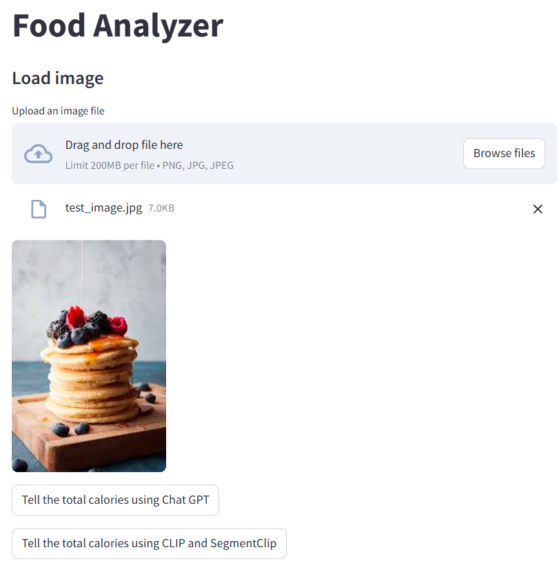

# Food Calories Analyzer - Technical Test Task

#### Prerequisites:
1. Install Python 3.10+ 
2. Install libraries from requirements.txt
3. Download csv data and onnx models from [drive](https://drive.google.com/drive/folders/1OxKl9TCdTaVF2rvU3VFfsSoCdZLoqg2T?usp=sharing)

To start test app run: 
> `streamlit run streamlit_app.py`

## Project Structure:

    .
    ├── models/                             # Folder with models
    │   ├── clipseg.onnx                    # Segmantation clip model
    │   ├── vit_emb.onnx                    # ViT embedder
    ├── data/                               # Folder with cvs files
    │   ├── food_calories.csv               # Dataset for different food and their calories
    │   ├── text_emb.csv                    # Embeddings for text classes
    │   ├── attention_mask.npy              # Data for segment clip
    │   ├── input_ids.npy                   # Data for segment clip 
    │   ├── test_image.jpg                  # Test image 
    ├── streamlit_app.py                    # Main script
    ├── image_processor.py                  # File with class of image processing by models
    ├── demo_image.jpg                      # Image that discribes demo app 
    ├── requirements.txt
    └── README.md

## App Functionality:

First you should upload image and than calories calculation can be done in 2 ways:
- Using ChatGPT
- Using CLIP and SegClip models

### Using ChatGPT
Request to ChatGPT (gpt-4o-mini) to analyze image and get info about calories with help of [gpt4free](https://github.com/xtekky/gpt4free/tree/main?tab=readme-ov-file) library. No keys are needed

### Using CLIP and SegClip models
First image converted into embeding space with [CLIP](https://github.com/openai/CLIP). Next it compared with predifined text embedings using Faiss. Text is some combinations of different product from food.csv. 
For most similar food segmantation model applies using [clipseg](https://github.com/timojl/clipseg/tree/master) in order to find area of this product on image. 
This area (pixel count) multipled by calories for corresponding food and divaded by 1000. All model are running using onnxruntime

## Demo image

